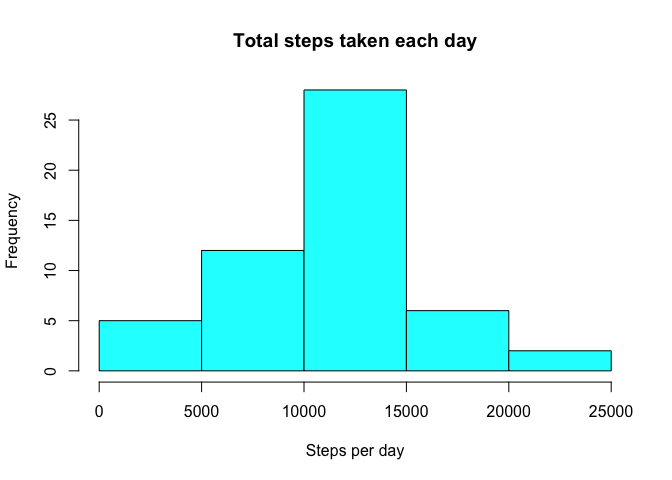
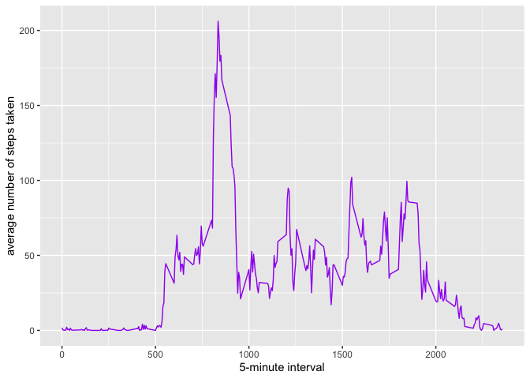
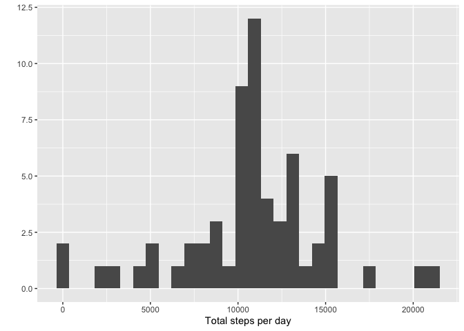
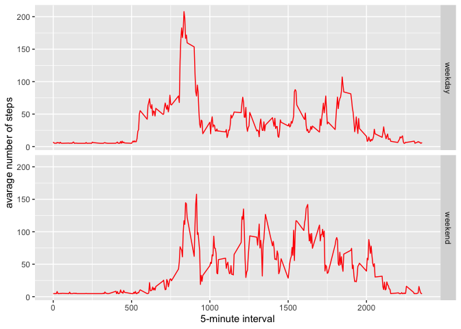

## Loading and preprocessing the data:


## Total number of steps taken per day:

```r
stepseachday<-aggregate(steps~date,activity,FUN=sum)
```

## Histogram of the total number of steps taken each day:

```r
hist(stepseachday$steps, xlab="Steps per day", main="Total steps taken each day", col="cyan")
```

<!-- -->

## Mean and Median of the total number of steps taken per day

```r
meansteps<- mean(stepseachday$steps, na.rm = TRUE)
mediansteps <- median(stepseachday$steps, na.rm = TRUE)
```
* Mean: 1.0766189\times 10^{4}
* Median:  10765

## Average daily activity pattern:

```r
averagestepstaken<- aggregate(x=list(meansteps=activity$steps), by=list(interval=activity$interval), FUN=mean, na.rm=TRUE)
```

#### Time series plot

```r
ggplot(data=averagestepstaken, aes(x=interval, y=meansteps)) +geom_line(color="purple") +
  xlab("5-minute interval") +ylab("average number of steps taken") 
```

<!-- -->

#### 5-minute interval containing maximum number of steps:

```r
mostSteps <- which.max(averagestepstaken$meansteps)
```


## Total number of missing values in the dataset:

```r
missingvalues <- length(which(is.na(activity$steps)))
```


##### Create a new dataset that is equal to the original dataset but with the missing data filled in:

```r
activityDataImputed <- activity
activityDataImputed$steps <- impute(activity$steps, fun=mean)
```


##### Make a histogram of the total number of steps taken each day:

```r
stepsByDayImputed <- tapply(activityDataImputed$steps, activityDataImputed$date, sum)
qplot(stepsByDayImputed, xlab="Total steps per day")
```

```
## `stat_bin()` using `bins = 30`. Pick better value with `binwidth`.
```

<!-- -->

##### Calculate and report the mean and median total number of steps taken per day: 

```r
stepsByDayMeanImputed <- mean(stepsByDayImputed)
stepsByDayMedianImputed <- median(stepsByDayImputed)
```
* Mean (Imputed): 1.0766189\times 10^{4}
* Median (Imputed):  1.0766189\times 10^{4}


----

## Are there differences in activity patterns between weekdays and weekends?
##### 1. Create a new factor variable in the dataset with two levels – “weekday” and “weekend” indicating whether a given date is a weekday or weekend day.


```r
activityDataImputed$dateType <-  ifelse(as.POSIXlt(activityDataImputed$date)$wday %in% c(0,6), 'weekend', 'weekday')
```

##### 2. Make a panel plot containing a time series plot


```r
averagedActivityDataImputed <- aggregate(steps ~ interval + dateType, data=activityDataImputed, mean)
ggplot(averagedActivityDataImputed, aes(interval, steps)) + 
    geom_line(color="red") + 
    facet_grid(dateType ~ .) +
    xlab("5-minute interval") + 
    ylab("avarage number of steps")
```

<!-- -->
